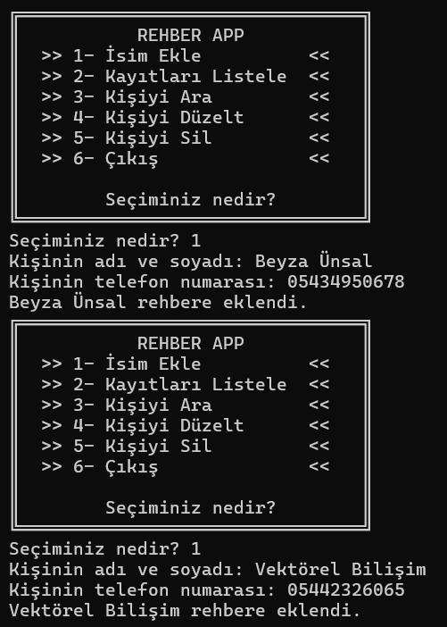
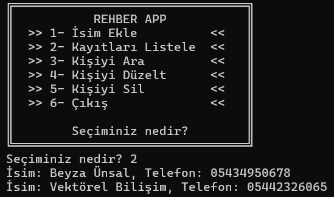
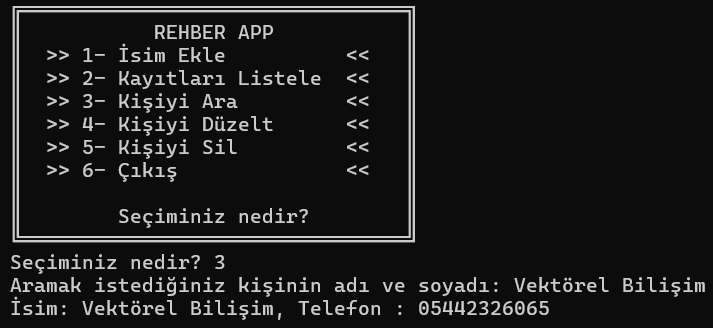
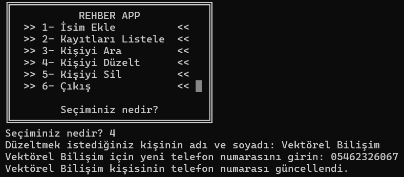

<h1>RehberApp / Rehber Uygulaması</h1>
Python tabanlı bir telefon rehberi uygulamasıdır.
Temel olarak kullanıcıların kişi bilgilerini ekleyebileceği, listeleyebileceği, arama yapabileceği, mevcut kişi bilgilerini düzeltebileceği ve kişileri silebileceği bir programdır. Bu tür bir uygulama, kullanıcıya basit ve anlaşılır bir komut satırı arayüzü sunabilir.

<b><h4>Rehbere Kişi Ekle</h4></b>

Kullanıcı,rehbere yeni bir kişi ekleyebilir. İsim ve telefon numarası bilgileri kaydedilir. 

<b><h4>Rehberdeki Kişileri Listele </h4></b>

Rehberde kayıtlı tüm kişileri listeleyebilir. Bu özellik ,kişilerin isimleri ve telefon numaralarını görmeyi sağlar.

<b><h4>Rehbere Kişi Ara</h4></b>

Kullanıcı, belirli bir isme göre arama yaparak rehberdeki kayıtlı kişileri görebilir.

<b><h4>Rehbere Kişi Düzenle</h4></b>

Kullanıcı, rehberdeki mevcut bir kişinin bilgilerini güncelleyebilir.

<b><h4>Rehberden Kişi Sil</h4></b>

Kullanıcı, rehberdeki bir kişiyi tamamen silebilir. Bu gereksiz veya eski kayıtları temizlemek için kullanışlıdır.